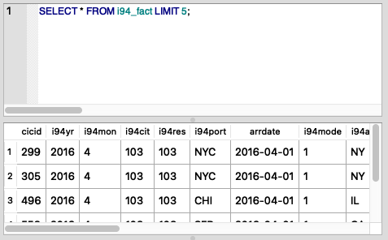
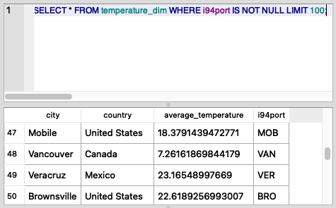
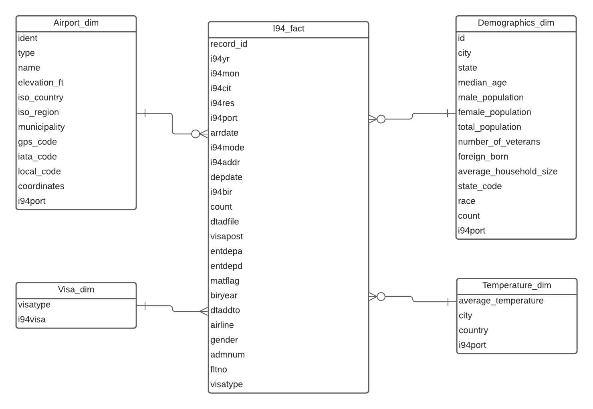

Udacity Data Engineering Capstone Project
==============================

Project Summary
------------
The goal of this project is to build an ETL pipeline to create a database storing I94 immigration data and related visa, temperature, demographics and airport information, which can be used to analyze and provide insight into the pattern of immigration.

Commands
------------

Note that the virtual environment has to be active to run the command below.

`make requirements` to install Python dependencieis

`make etl` to create an SQL database using data from data/raw

`make validate` to validate each table in SQL database

`make clean` to remove all compiled Python files

`make lint` to check the source code using flake8

Jupyter Notebook
------------

[**➠   Go to the Capstone Project Jupyter Notebook**](Capstone%20Project.ipynb)

Sample Result by Running SQL Queries in Output Database
------------
- Get fact table data

- Get temperature dimension table data

Data Model
------------

A star schema is used for data model as there are only a small number of tables. If analysts want to pull the data from different tables, they can use the simple `JOIN`s for a fast query processing.

- The fact table is I94_fact, which contains I94 related information for each record. This table is the main table that can be used for immigration analysis and can be connected to other tables for a futher insight.

- Airport_dim includes data regarding airports, which can be used to analyze the impact of elevation or build geographic maps.

- Visa_dim contains the visa types and their corresponding I94 Visa Codes.

- Demographics_dim links to I94 fact table stemming from demograpihcs dataset. This table contains the population profiles by city in the U.S.

- Temperature_dim provides the average temperature by city, which can be used to analyze the relatinoship between the temperature and I94 records.

Tools
------------
Python, Spark, SQLite, ER Diagram

Database
------------
SQLite is used as the output database. You can also set environment variables in `.env` and modify configurations to use other databases like AWS Redshift as target database.

Project Organization
------------

    ├── LICENSE
    ├── Makefile           <- Makefile with commands like `make db`.
    ├── README.md          <- The top-level README for developers using this project.
    │
    ├── Capstone Project.ipynb <- Jupter notebook for visualization, etl and validation.
    │
    ├── data
    │   ├── processed      <- The final target database storing processed data.
    │   └── raw            <- The original, immutable data dump.
    │
    ├── db_driver          <- database driver of SQLite for Spark.
    │
    ├── etl.py             <- Python file containing ETL pipeline code.
    │
    ├── references         <- Images, and all other explanatory materials.
    │
    ├── requirements.txt   <- The requirements file for reproducing the analysis environment, e.g.
    │                         generated with `pip freeze > requirements.txt`.
    │
    ├── setup.py           <- makes project pip installable (pip install -e .) so src can be imported.
    │
    ├── src                <- Source code for use in this project.
    │   ├── __init__.py    <- Makes src a Python module.
    │   │
    │   ├── data_model.py  <- Python file including database table creation functions.
    │   │
    │   ├── utility.py     <- Python file containing utility functions.
    │   │
    │   └── validation.py  <- Python file to validate database.
    │
    └── tox.ini            <- tox file with settings for running tox; see tox.testrun.org

--------
